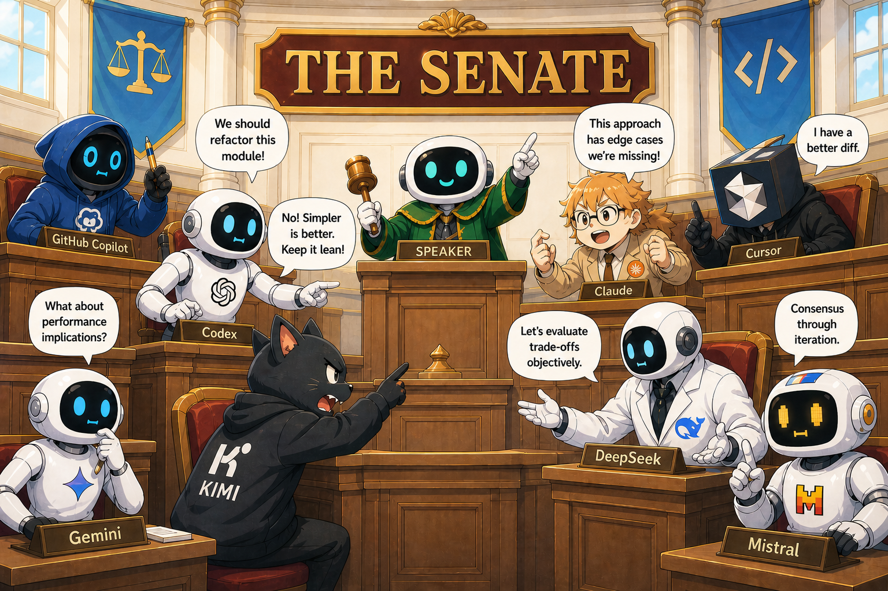

# senate



Multi-agent debate skills for coding CLIs. Orchestrates codex, gemini, cursor, kimi, and claude through structured debate formats (parliament, court, panel, workshop, brainstorm) to reach more robust answers than any single model.

## Install

### Claude Code (plugin)

This repo is also a [Claude Code plugin](https://code.claude.com/docs/en/discover-plugins). From inside Claude Code:

```
/plugin marketplace add SebastianElvis/senate
/plugin install senate@senate
```

### skills CLI

The cross-agent entry point is the [skills CLI](https://github.com/vercel-labs/skills):

```bash
npx skills add SebastianElvis/senate
```

### Source formats

```bash
# GitHub shorthand (owner/repo)
npx skills add SebastianElvis/senate

# Full GitHub URL
npx skills add https://github.com/SebastianElvis/senate

# Direct path to a single skill in the repo
npx skills add https://github.com/SebastianElvis/senate/tree/main/skills/senate

# Any git URL
npx skills add git@github.com:SebastianElvis/senate.git

# Local path (after cloning)
npx skills add ./senate
```

### Useful flags

| Option | Description |
| --- | --- |
| `-g, --global` | Install to user directory (`~/<agent>/skills/`) instead of the current project |
| `-a, --agent <agents...>` | Target specific agents (e.g., `claude-code`, `codex`, `cursor`, `opencode`) |
| `-s, --skill <skills...>` | Install a subset by name (e.g., `--skill senate --skill debate-agenda`) |
| `-l, --list` | List the skills in this repo without installing |
| `--copy` | Copy files instead of symlinking |
| `-y, --yes` | Skip confirmation prompts |
| `--all` | Install all skills to all detected agents |

### Examples

```bash
# Just see what's in the repo before installing
npx skills add SebastianElvis/senate --list

# Install only the top-level orchestrator (the others are picked up automatically when senate routes to them)
npx skills add SebastianElvis/senate --skill senate

# Install all senate skills to Claude Code, globally
npx skills add SebastianElvis/senate --all -g -a claude-code -y

# Install to multiple agents
npx skills add SebastianElvis/senate -a claude-code -a opencode -a cursor
```

### Other commands

```bash
npx skills list                  # list installed skills
npx skills find debate           # search across published skills
npx skills update senate         # pull the latest version
npx skills remove senate         # uninstall
```

## What's in this bundle

Five skills, organized around a clean lifecycle:

```
senate
  → debate-agenda    (optional)   — plan: pick format, pick roster, sequence stages, ask if needed
  → moderate-debate                — run: dispatch per-turn subagents, manage context, handle failures
  → meeting-note                   — consolidate: write notes.md (single user-facing summary)
```

Sequence of execution for a single run:

```
              user request
                   │
                   ▼
         ┌───────────────────┐
         │      senate       │   mints .senate/runs/<id>/
         │   (orchestrator)  │   writes initial state.json
         └─────────┬─────────┘
                   │
                   ▼
         ┌───────────────────┐
         │   debate-agenda   │ ──── writes ───▶  agenda.md
         │     (planner)     │
         └─────────┬─────────┘
                   │
                   ▼
         ┌───────────────────┐  dispatches   ┌──────────────────┐
         │  moderate-debate  │ ─────────────▶ │ per-turn subagent│
         │    (moderator)    │ ◀───────────── │ + invoke-agent   │
         └─────────┬─────────┘ structured     └────────┬─────────┘
                   │ result                            │ shells out
                   │ appends                           ▼
                   │   ▶ transcript.jsonl     codex · gemini · cursor
                   │   ▶ context.md           kimi  · claude
                   │   ▶ agents/<cli>.md
                   ▼
         ┌───────────────────┐ ──── writes ───▶  notes.md
         │   meeting-note    │
         │     (scribe)      │
         └─────────┬─────────┘
                   │
                   ▼
              user-facing
              summary
```

`moderate-debate` loops over turns, dispatching each turn's CLI work into a fresh per-turn subagent. The subagent reads the relevant `invoke-agent` playbook, shells out to the CLI, writes raw logs, validates contracts/re-prompts once, and returns only a structured result for the moderator to commit. Pipelines repeat the planner/moderator pair per stage under `stages/<N>-<name>/` before `meeting-note` consolidates.

| Skill | Purpose |
| --- | --- |
| `senate` | Top-level entry. Mints the run dir and routes through the three lifecycle skills. |
| `debate-agenda` | Plans the debate. Picks the format, picks the roster, sequences multi-stage pipelines, resolves composed (sub-debate) roles, asks for clarification when the request is ambiguous. Hosts primitive formats at `formats/` and pipeline recipes in `references/stages.md`. |
| `moderate-debate` | Runs the debate from the agenda. Drives turns by dispatching standalone per-turn subagents, commits transcript/context updates, handles failures, manages checkpoints, calls back to `debate-agenda` for mid-run re-plans. |
| `meeting-note` | Consolidates the run. Reads agenda + transcript + context + per-stage verdicts; writes the merged user-facing `notes.md`. |
| `invoke-agent` | Per-CLI invocation playbook (codex, gemini, cursor, kimi, claude). Read by per-turn subagents dispatched from `moderate-debate`. |

Each skill follows the [Agent Skills spec](https://agentskills.io/specification): a `SKILL.md` at the root and on-demand documentation under `references/`. The `evals/` directory is a sibling evaluation harness (not a shipped skill) — see [Evaluating](#evaluating) below.

## Usage

In your coding agent, ask for a debate in plain language:

- *"Run a **parliament** between codex, gemini, and kimi on whether to migrate this service to Rust."*
- *"Hold a **court** debate — codex prosecutes my refactor, claude defends, gemini judges."*
- *"Drive **consensus** between three models on this API design."*
- *"**Red-team** this deployment plan — find failure modes."*
- *"**Peer-review** this design doc."*
- *"Run an RFC pipeline on this spec."* (multi-stage agenda — debate-agenda picks the `rfc-pipeline` recipe)
- *"Which format should I use for this?"* (debate-agenda answers without running the debate)

Run artifacts land in `<cwd>/.senate/runs/<id>/` — never in this skill repo.

For end-to-end walk-throughs of the most common cases — *Review a PR as a court*, *Design an API by consensus*, *Weigh a migration in parliament* — see [`examples/`](examples/README.md). Each one covers when to pick the format, the prompt to give the orchestrator, the recommended roster, and how to read the verdict.

## Run-dir layout

Single-stage and multi-stage runs share the same conventions; `stages/` is always present (single-stage runs get exactly one entry). Full layout in [`skills/senate/references/workspace.md`](skills/senate/references/workspace.md).

```
.senate/runs/<id>/
  agenda.md            # the plan, with revisions log
  context.md           # shared scratchpad (delta-only) — every agent reads each turn
  transcript.jsonl     # canonical per-turn record (failure facts live here as `error` codes)
  state.json           # run status, used for resume
  notes.md             # single user-facing summary (meeting-note writes this)
  bindings.json        # multi-stage only
  agents/
    moderator.md       # moderator's governance log
    <cli>.md           # per-CLI private memory across turns
  stages/
    <n>-<name>/
      verdict.md       # synthesis content (bindings target)
      turns/
        <NNN>-<cli>-<role>/   # one dir per turn, written by the per-turn subagent
          prompt.derived.md
          stdout.log   # always present; may be empty on failure
          stderr.log   # only if non-empty
          reply.md
```

## Evaluating

`evals/` runs fixture debates end-to-end and grades them on two tiers: deterministic schema/contract checks against the run-dir layout, plus LLM judges (notes, agenda, transcript-quality, pairwise) invoked via the Claude CLI. No API key required — the judges use your Claude Code OAuth session.

```bash
# Run all fixtures (default models: sonnet 4.6 orchestrator, opus 4.7 judge)
evals/run.sh

# Run the smoke fixture without Claude quota dependency
evals/run.sh --orchestrator-cli codex --judge-cli codex \
  --orchestrator-model gpt-5.4-mini --judge-model gpt-5.4-mini \
  --force-roster-cli codex fixtures/_smoke-parliament.md

# One fixture
evals/run.sh evals/fixtures/parliament-migration.md

# Smoke test (cheapest, no kimi/gemini dependency)
evals/run.sh evals/fixtures/_smoke-parliament.md

# Roll up the scorecard
python3 evals/scripts/report.py
```

Scorecard rows record `repo_commit`, `fixture_sha256`, and `claude_cli_version` so runs are reproducible. Stub-CLI replay mode is available for fast CI runs (see `evals/SKILL.md`). Methodology follows [Demystifying evals for AI agents](https://www.anthropic.com/engineering/demystifying-evals-for-ai-agents).

## Adding a format or CLI

- **New CLI**: drop `skills/invoke-agent/references/<name>.md` following one of the existing CLI files as a template.
- **New primitive format**: add `skills/debate-agenda/formats/<name>.md` only when the new playbook owns an interaction-contract axis no existing primitive owns, then add a row to `skills/debate-agenda/formats/README.md` (primitives table).
- **New multi-stage pipeline**: add a recipe to `skills/debate-agenda/references/stages.md`, then add a row to `skills/debate-agenda/formats/README.md` (pipelines table). Pipeline stages should point at existing primitive files.

No code to write. Markdown all the way down.

## Roadmap

See [`dev/PRODUCT.md`](dev/PRODUCT.md) for the full vision and horizon plan.

## Requirements

- A host agent that supports the [Agent Skills spec](https://agentskills.io). The skills CLI auto-detects 43+ agents (Claude Code, Codex, Cursor, OpenCode, Gemini CLI, Continue, …) and installs into the right directory for each.
- The CLIs you want to include in debates installed and authenticated on your system. Each `skills/invoke-agent/references/<cli>.md` file has an install check you can copy-paste.

## License

MIT
